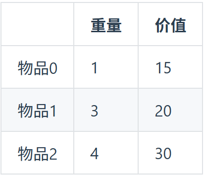

# 动态规划总结

## 背包问题

### 0-1 背包

使用一维数组较容易理解,且占据空间不多，所以使用一维数组


则物品的最大价值是多少

dp[j]表示容量为 j 的背包,所能装的最大价值是 j

dp[j]=max(dp[j],dp[j-weight[i]]+value[i]);这段话含义是

不选物品 i：背包容量 j 不变，价值保持 dp[j]。

选物品 i：背包容量减少 weight[i]，但价值增加 value[i]。

初始化的时候:一般给 dp[0]=0，这段话的含义是背包容量为 0 时所能装的最大价值为 0

遍历顺序:

```cpp
    for(int i=0;i<=物品数量;i++)
    {
        for(int j=weight;j>=weight[i];j--)//背包容量
        {
            dp[j]=max(dp[j],dp[j-weight[i]]+value[i]);
        }
    }
```

倒序遍历背包容量是为了防止重复记录重量,因为每个物品只有一个

#### 询问背包最多能装多少一般使用递推公式 dp[j]=max(dp[j],dp[j-nums[i]]+nums[i])，对应题型如下：

**_416 分割等和子串_**

**_1049 最后一块石头的重量 II_**

#### 问背包装满有几种方法使用递推公式 dp[j]+=dp[j-nums[i]]，题型如下

**_494 目标和_**

**_518 零钱兑换 II_**

**_377 组合总和_**

#### 背包装满的最大价值使用递推公式 dp[j]=max(dp[j]-weight[i]+value[i])

**_474 一和零_**

#### 问装满背包所有物品的最小个数：dp[j] = min(dp[j - weight[i]] + 1, dp[j]);

**_322 零钱兑换_**

**_279 完全平方数_**

### 完全背包

**_完全背包在形式上几乎和 0-1 背包一样,只有在遍历的时候有区别_**

完全背包在遍历背包容量时使用的是正序遍历,因为在完全背包的题型下,每个物品被视为无限多

先遍历物品后遍历背包容量，还是先遍历背包容量再遍历物品，在排列题和组合题的用法不一样

```cpp
// 组合数：外层遍历物品，内层遍历背包
int combinationSum(vector<int>& nums, int target)
{
vector<int> dp(target + 1, 0);
dp[0] = 1; // 初始化：总和为 0 的组合有 1 种（不选任何物品）

    for (int i = 0; i < nums.size(); i++)
    {      // 遍历物品
        for (int j = nums[i]; j <= target; j++)
        { // 遍历背包
            dp[j] += dp[j - nums[i]];
        }
    }

    return dp[target];

}

// 排列数：外层遍历背包，内层遍历物品
int permutationSum(vector<int>& nums, int target)
{
vector<int> dp(target + 1, 0);
dp[0] = 1; // 初始化：总和为 0 的排列有 1 种（不选任何物品）

    for (int i = 1; i <= target; i++)
    {          // 遍历背包
        for (int j = 0; j < nums.size(); j++)
        {  // 遍历物品
            if (i >= nums[j])
            {
                dp[i] += dp[i - nums[j]];
            }
        }
    }

    return dp[target];

}
```

比如[1,2],[2,1]在组合时会被认为是一个组合

排列则会将这两个当做不一样排列形式

组合题:**_518 零钱兑换 II_**

排列题:**_377 组合总和 IV_**

### 最长序列

当题目为连续序列时使用 dp[i] = dp[i - 1] + 1;进行递推

**_674 最长连续递增序列_**

**_718 最长重复子数组_**

当题目不为连续序列时使用 dp[i] = max(dp[i], dp[j] + 1);或 dp[i][j] = max(dp[i - 1][j], dp[i][j - 1]);进行递推

**_300 最长上升子序列_**

**_1143 最长公共子序列_**
